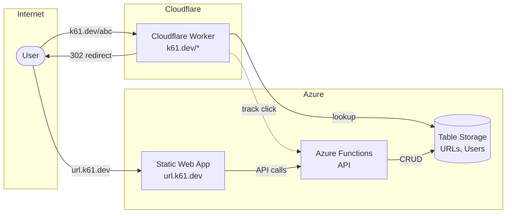
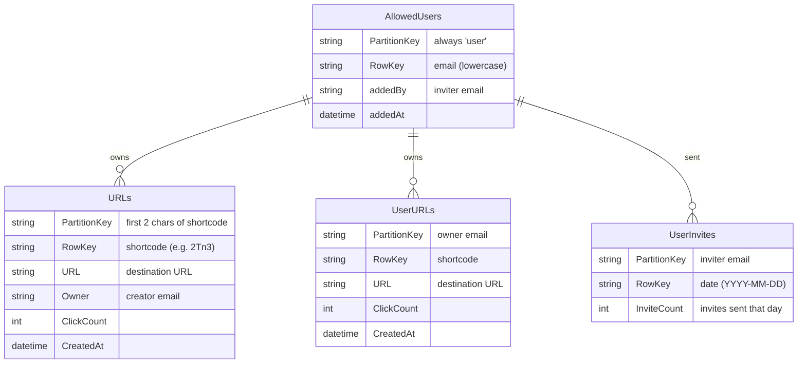

# k61.dev URL Shortener

[](https://github.com/kurtzeborn/url-shortener/actions/workflows/deploy-functions.yml)
[](https://github.com/kurtzeborn/url-shortener/actions/workflows/deploy-web.yml)
[](https://github.com/kurtzeborn/url-shortener/actions/workflows/deploy-worker.yml)
[](https://github.com/kurtzeborn/url-shortener/actions/workflows/test.yml)

A serverless URL shortener built on Azure and Cloudflare with sub-10ms edge redirects.

## Architecture



## Table Schema



## Features

- ⚡ **Sub-10ms redirects** via Cloudflare Workers edge network
- 🔐 **Microsoft account auth** with allowlist access control
- 📊 **Dashboard** with click tracking, sorting, pagination
- 🎯 **Short 4-char IDs** - 14.7M capacity (base62)
- 🆓 **Free tier** - All services within free limits

## Cost

All services run within free tier limits:

| Service | Free Limit |
|---------|------------|
| Azure Functions | 1M executions/month |
| Azure Table Storage | ~$0.045/GB + $0.00036/10K transactions |
| Azure Static Web Apps | 100GB bandwidth/month |
| Cloudflare Workers | 100K requests/day |
| GitHub Actions | 2000 min/month (public repo) |

## Project Structure

```
├── workers/      # Cloudflare Worker (redirects)
├── functions/    # Azure Functions (API)
├── web/          # Dashboard app (url.k61.dev)
└── docs/         # Documentation
```

## Development

```bash
# Install dependencies
npm install

# Run tests
npm test

# Run linter
npm run lint
```

### Local Development

```bash
# Functions (requires Azure Functions Core Tools)
cd functions && npm start

# Web dashboard
cd web && npm run dev
```

## Deployment

All deployments are automatic via GitHub Actions on push to `main`:

| Component | Workflow | Destination |
|-----------|----------|-------------|
| Worker | deploy-worker.yml | Cloudflare Workers |
| Functions | deploy-functions.yml | Azure Functions |
| Web | deploy-web.yml | Azure Static Web Apps |

## Data Model

**Azure Table Storage tables:**

- `URLs` - Short ID → destination URL mapping
- `UserURLs` - Per-user URL index for dashboard
- `AllowedUsers` - Email allowlist
- `UserInvites` - Daily invite rate limiting

## License

MIT
