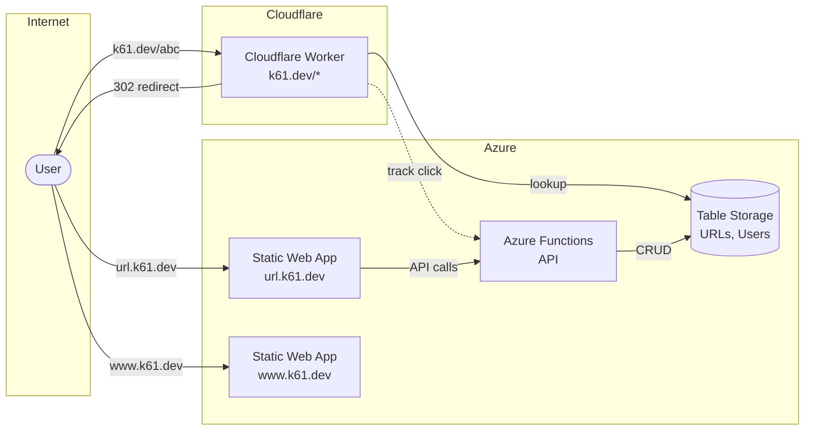

# k61.dev URL Shortener

A serverless URL shortener built on Azure and Cloudflare with sub-10ms edge redirects.

## Architecture



## Features

- ⚡ **Sub-10ms redirects** via Cloudflare Workers edge network
- 🔐 **Microsoft account auth** with allowlist access control
- 📊 **Dashboard** with click tracking, sorting, pagination
- 🎯 **Short 4-char IDs** - 14.7M capacity (base62)
- 🆓 **Free tier** - All services within free limits

## Project Structure

```
├── workers/      # Cloudflare Worker (redirects)
├── functions/    # Azure Functions (API)
├── web/          # Dashboard app (url.k61.dev)
├── landing/      # Landing page (www.k61.dev)
└── docs/         # Documentation
```

## Development

```bash
# Install dependencies
npm install

# Run tests
npm test

# Run linter
npm run lint
```

### Local Development

```bash
# Functions (requires Azure Functions Core Tools)
cd functions && npm start

# Web dashboard
cd web && npm run dev

# Landing page
cd landing && npm run dev
```

## Deployment

All deployments are automatic via GitHub Actions on push to `main`:

| Component | Workflow | Destination |
|-----------|----------|-------------|
| Worker | deploy-worker.yml | Cloudflare Workers |
| Functions | deploy-functions.yml | Azure Functions |
| Web | deploy-web.yml | Azure Static Web Apps |
| Landing | deploy-landing.yml | Azure Static Web Apps |

## Data Model

**Azure Table Storage tables:**

- `URLs` - Short ID → destination URL mapping
- `UserURLs` - Per-user URL index for dashboard
- `AllowedUsers` - Email allowlist
- `UserInvites` - Daily invite rate limiting

## License

MIT
